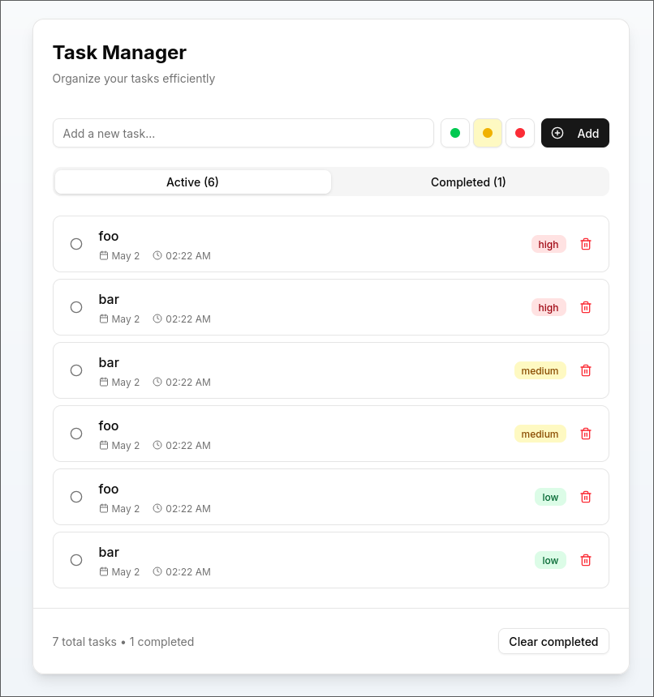

# Multi-Service Application 
This project is part of [roadmap.sh](https://roadmap.sh/projects/multiservice-docker) DevOps projects.

---
This project simulates a real-world, production-like environment using Docker. It includes a multi-service setup with best practices like custom base images, multi-stage builds, Docker secrets, persistent volumes, health checks, optimized Dockerfiles, logging, and more.

The service i maked is simplate Note taking app.
   
# Tech Stack
- Next.js (Frontend)
- Node.js + Express (Backend)
- MongoDB (Database)
- Redis (Cache)
- Nginx (Reverse Proxy)
- Grafana (Data Visualization)
- Loki (Storing Logs)
- Promtail (Log Collecting from Docker)
- Docker (Containers)
- Docker Compose 

# Service Endpoints
- Frontend [http://localhost:3000](http://localhost:3000)
- Backend [http://localhost:3000/tasks](http://localhost:3000/tasks) 
- Grafana [http://localhost:3000/grafana](http://localhost:3000/grafana)
- MongoDB (Internal only) [http://mongodb://27017/tasks](http://mongodb://27017/tasks)
- Redis (Internal only) [http://redis:6379](http://redis:6379)
- Loki (Internal only) [http://loki:3100](http://loki:3100)

# Getting Started
1. Clone the Repository
```bash
git clone https://github.com/cilginc/multiservice-docker.git
cd multiservice-docker
```
2. Run the Docker Compose file
```bash
docker compose up -d --build
```
---
